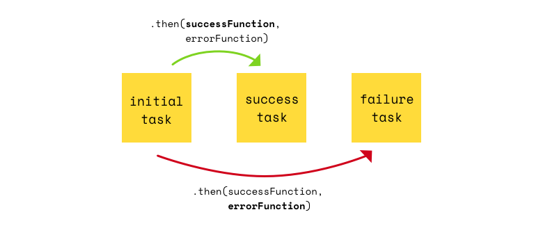
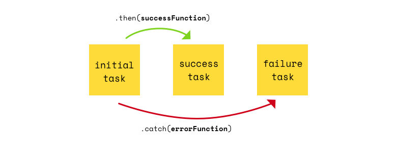

# Javascript promisses 101

A JavaScript Promise represents the result of an operation that hasn't been completed yet, but will at some undetermined point in the future. When we fetch data from some source, for example an API, there is no way for us to absolutely determine when the response will be received.

## creating promise

constructor accepts function with two arguments as its parametrs:

```javascript
var promise = new Promise( function (resolve, reject) {
  //Promise content
});

```

where **resolve** - "go to next action", **reject** - handle errors.

Example: Aax with Promisses:

```javascript
function get(url) {
  return new Promise(function (resolve, reject) {
    var req = new XMLHttpRequest();
    req.open("GET", url);

    req.onload = function () {
      if (req.status == 200) {
        resolve(req.response);
      } else {
        reject(Error(req.statusText));
      }
    };

    req.onerror = function () {
      reject(Error("NetworkError"));
    };

    req.send();
  });
}
```

## using promises

once we have created the promises we must use it. Function than using


## Handling errors

